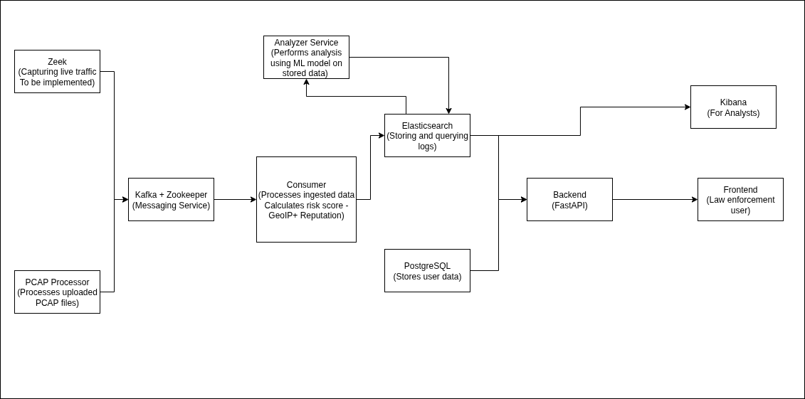
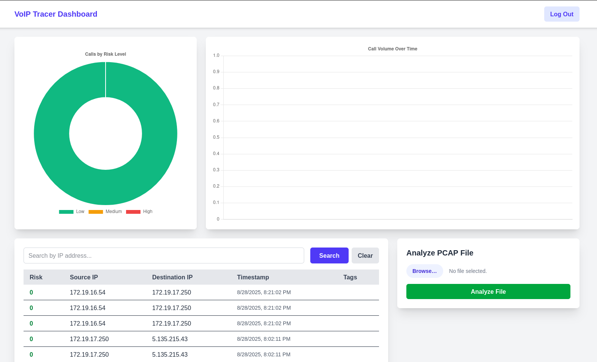

# VoIP Tracer

Built this project as part of the [CIIS Hackathon 2025](https://ciisummit.com/cybershield-hackathon-2025/).

## Description

The VoIP Tracer is a complete pipeline established from data ingestion to analysis outputs. 

- It has two main sources of inputs - a Zeek service which can be connected to a network using a VTAP or a SPAN/mirror port to stream network traffic to it, or directly ingest a pcap file of captured network traffic for analysis
- In case of traffic through Zeek, which filters SIP and conn logs in JSON format and sends them to filebeat which takes these logs and sends them to the Kafka service under the topic of "voip_logs"
- Ingesting data through pcap, we have a pcap-processor service running, which listens for messages on the "pcap_jobs" topic from Kafka. Messages to this topic are send by our backend API when any file is uploaded through its endpoint. The pcap-processor again performs the same packet filtering and sends the logs to the "voip_logs" topic.
- For the "voip_logs" topic, we have a consumer service setup to listen to it, which takes in the filtered logs and performs the necessary analysis, calculating risk scores based on threat intelligence feeds() and GeoIP location. This data is then indexed and stored in Elasticsearch.
- We have another analysis service which uses an Isolation Forest model, trained on the input data itself, to correlate data between the SIP and conn logs and extract the necessary features to perform anomaly detection on the data and update the risk scores.
- Then, we have our Backend API, which provides endpoints for querying the Elasticsearch service and fetching ingested and processed data. It also serves endpoints for user authentication and registration, which we use for user management on our frontend dashboard.
- The frontend is two-fold, the first is the Kibana dashboard that is setup with Elasticsearch - this is for analysts to perform deeper analysis and visualize the results, the second one is the Next.js frontend that is for officers to view the analysis results of our pipeline and any updates from the analysts

---

## Flowchart

--- 

## Working Prototype

